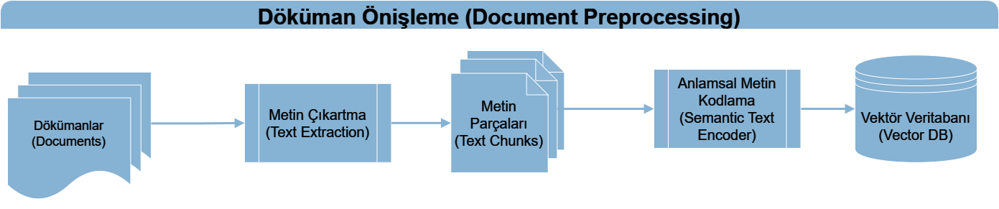
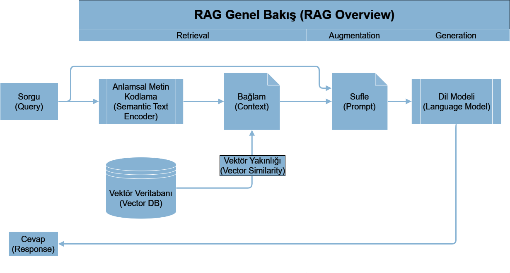

# A RAG project to chat/query Turkish PDF docs 

https://github.com/mgoksu/Chat-PDF-for-turkish/assets/6663498/7269f03d-d995-409b-ae4c-911d49f6ee5b

## Nasıl Kullanılır

1. Repoyu indirin.
   ```bash
   git clone https://github.com/mgoksu/Chat-PDF-for-turkish
   ```

2. requirements.txt dosyasından gerekli paketleri yükleyin.
   ```bash
   pip install -r requirements.txt
   ```

3. Streamlit'i çalıştırın.
   ```bash
   streamlit run app.py
   ```

4. Tarayıcınızdan terminalde gösterilen Local URL adresine gidin. Muhtemelen `http://localhost:8501` olarak gelecek.

## Proje Genel Bakış
### Döküman Önişleme

### RAG


## Kullanılan Kaynaklar
- PDF dosyalarını okumak için PyPDF2
- Vektör DB olarak [Faiss](https://github.com/facebookresearch/faiss)
- Semantic Encoding için [e5-base-v2](https://huggingface.co/intfloat/e5-base-v2)
- Dil modeli olarak [SambaLingo-Turkish-Chat](https://huggingface.co/sambanovasystems/SambaLingo-Turkish-Chat)

### Alternatifler
Bu kaynaklar birbirinden bağımsız olduğundan herhangi birini alternatifiyle değiştirerek farklı sistemler deneyebilirsiniz. 
- Semantic Encoding için: 
  - Daha büyük model olan [e5-large-v2](https://huggingface.co/intfloat/e5-large-v2).
- Ben daha iyi sonuçlar alamasam da dil modeli olarak:
  - [THUDM/glm-4-9b-chat](https://huggingface.co/THUDM/glm-4-9b-chat)
  - [ytu-ce-cosmos/Turkish-Llama-8b-v0.1](https://huggingface.co/ytu-ce-cosmos/Turkish-Llama-8b-v0.1)

## Farklı RAG parametreleri
`app.py` dosyasından retrieval, sampling parametreleri ve prompt template'ı ile oynayıp testler yapabilirsiniz. Şu anki haliyle deterministic çalışıyor.

## Test Ortamı
Ben RTX 4060 Ti (16GB VRAM) ve 8-bit quantization ile test yapabildim. CPU ile denemedim.

## Test PDF dosyasından bazı Örnekler 
**SORU:**  Bağıl değerlendirme sistemi nedir? <br/>
**CEVAP:** Bağıl değerlendirme sistemi, öğrencilerin dönem içi çalışmaları, ara sınavları, dönem sonu sınavları ve bütünleme sınavları notlarının ağırlıklarına göre belirlenen başarı not ortalamasını, o dersi alan öğrencilerin başarı düzeyine göre belirleyen bir değerlendirme sistemidir. Bu sistem, öğrencilerin belirli bir dersteki performansını, sınıfındaki diğer öğrencilerin performanslarıyla karşılaştırır.

**SORU:**  Akademik takvim ne zaman hazırlanır? <br/>
**CEVAP:** Akademik takvim, bir önceki eğitim-öğretim yılının en geç Haziran ayı içinde Senato tarafından kararlaştırılır.

**SORU:**  Dört yıllık lisans programını ne kadar zamanda bitirmeliyim? <br/>
**CEVAP:** Dört yıllık lisans programını yedi yıl içinde tamamlamanız gerekmektedir.

## Teşekkür - Acknowledgements
- Streamlit HTML ve CSS görsel şablonu: [https://github.com/ArmaanSeth/ChatPDF](https://github.com/ArmaanSeth/ChatPDF)
- Faydalanılan okumalar
  - [Beyond English: Implementing a multilingual RAG solution](https://towardsdatascience.com/beyond-english-implementing-a-multilingual-rag-solution-12ccba0428b6)
